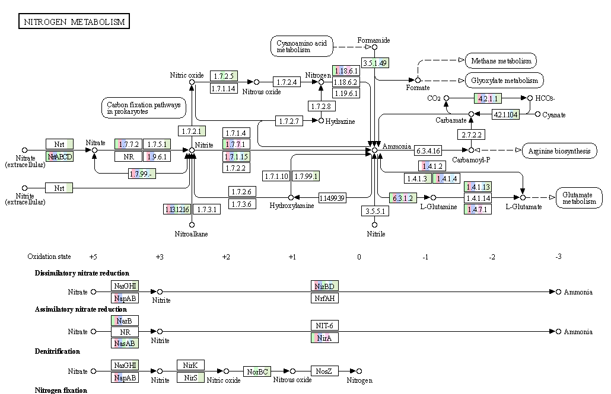

This is the home page of the metagenomics practical by Laura Dijkhuizen.
Click [here](/) to go to my personal home page, 
or go to the [github repository](https://github.com/lauralwd/metagenomicspractical) containing the practical files.
A [separate branch](https://github.com/lauralwd/metagenomicspractical/tree/example) of the same GitHub repository contains answers and example code of the practical.

## About the practical
Read more about the practical on the [about page](/metagenomicspractical/about/).
This includes a basic description, instalation details, and learning goals.

In the workflow thought here, you start with a metagenome assembly like this one:

The practical is closed by browsing through the metabolic capacity of the microbial genomes you'll find. 
For example like in the snapshot below.
This picture shows genes encoding the nitrogen cycle and the presence of these genes in the bins acquired during the practical.
The various colours indicate the different bins found during the practical.

## Materials
FastQC reports for the paired end reads of the L1 sample are available here online.
* [L1 Forward reads](fastqc_reports/L1.R1.fastqcreport.html)
* [L1 Reverse reads](fastqc_reports/L1.R2.fastqcreport.html)
* [P1 Forward reads](fastqc_reports/P1.R1.fastqcreport.html)
* [P1 Reverse reads](fastqc_reports/P1.R2.fastqcreport.html)

An example depth matrix is available [here](data/depth_matrix.tab)

The visualisation (excel) exercises in the notebooks are shared [here via google spreadsheats](https://docs.google.com/spreadsheets/d/1Cdkl8dT75CETGUA_l52Gh8g8qtWd9vv4QAGtTe9HpPU/edit#gid=1292451652).

CheckM outputs are stored in the example branch of the practial.
One file is available for the taxonomy workflow, set to 'Bacteria' [here](https://github.com/lauralwd/metagenomicspractical/blob/example/data/checkm_taxonomy/checkm_taxonomy_summary.txt)
Another file is available for the lineage workflow.
This is the more advanced workflow that tries to determine the lineage of a microbial genome before looking for single copy marker genes.
Find the output of checkm [here](https://github.com/lauralwd/metagenomicspractical/blob/example/data/checkm_lineage/checkm_lineage_summary.txt)

Prokka mapping tables for visualisation in KEGG are stored in the main branch of the GitHub repo [here](https://github.com/lauralwd/metagenomicspractical/tree/main/data/blastKOala).
These files should be available in the GitHub repo you cloned yourself.
You can make these yourself with the prokka protein files and blastKOala online as well.

## Blank example of the practical
Find the GitHub page for the practical [here](https://github.com/lauralwd/metagenomicspractical). 
Blank static examples of the practical pages are available through the links below: 
* [m00 prepare, download and subset reads](practical_pages/m00-prepare_download_and_subset_reads.html)
* [m01 introduction text](practical_pages/m01-introduction.html)
* [m02 juPyter and BASH basics](practical_pages/m02-jupyter_and_bash_basics.html)
* [m03 asses raw data](practical_pages/m03-assess_raw_data.html)
* [m04 plot assembly length and depth](practical_pages/m04-plot_assembly_length.html)
* [m05 backmapping raw reads](practical_pages/m05-backmapping.html)
* [m06 sorting your bam file](practical_pages/m06-sorting_bamfiles.html)
* [m07 binning part 1](practical_pages/m07-binning_part1.html)
* [m08 binning part 2](practical_pages/m08-binning-part2.html)
* [m09 quality control with checkm](practical_pages/m09-QC_checkm.html)
* [m10 annotation of microbial genomes](practical_pages/m10-annotation.html)
* [m11 bonus: bin taxonomy](practical_pages/m11-bonus_exercise_bin_taxonomy.html)

## Example code / answers
A branch of the original GitHub repository contains the practical with worked out examples and some intermediate files.
Find [this branch here](https://github.com/lauralwd/metagenomicspractical/tree/example) or browse through them as static html pages.
Static pages with pre-filled code can be found through the links below:
* [m00 prepare, download and subset reads](practical_example/m00-prepare_download_and_subset_reads.html)
* [m01 introduction text](practical_example/m01-introduction.html)
* [m02 juPyter and BASH basics](practical_example/m02-jupyter_and_bash_basics.html)
* [m03 asses raw data](practical_example/m03-assess_raw_data.html)
* [m04 plot assembly length and depth](practical_example/m04-plot_assembly_length.html)
* [m05 backmapping raw reads](practical_example/m05-backmapping.html)
* [m06 sorting your bam file](practical_example/m06-sorting_bamfiles.html)
* [m07 binning part 1](practical_example/m07-binning_part1.html)
* [m08 binning part 2](practical_example/m08-binning-part2.html)
* [m09 quality control with checkm](practical_example/m09-QC_checkm.html)
* [m10 annotation of microbial genomes](practical_example/m10-annotation.html)
* [m11 bonus: bin taxonomy](practical_example/m11-bonus_exercise_bin_taxonomy.html)

